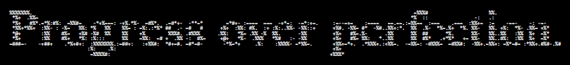

<table width="100%" cellspacing="0" cellpadding="0" border="0">
<tr>

<td width="55%" align="center" valign="top">

 

     
<strong>Aishwary Vishwakarma</strong> 
<code>NIT DELHI</code>

</td>

<td width="45%" valign="top">

<pre>
Aethernox@Aishwary ────────────────────────────────────────

OS: ------------------------- Windows 11, Android 14, Linux
Uptime: ------------------------ 5 Years, 6 Months, 12 Days 
Host: ------------------------------------------------- Leo
Kernel: ------- Microsoft Windows [Version 10.0.26200.9168]

Experience: ---- @Knowel.Ai @CosmoLife @GDSE @Kinetics @TNP
Role: --------------- AI/ML {AI Model Engineer && Robotics}
Focus: ----------- NLP • Gen AI • RL & DL • Computer Vision
Languages: --------------------------- Python, C++, C, Java
Tools: --------------------- Git, Docker, AWS, GCP, Jupyter

Interests: ----------- Chess, Reading, Travel & Exploration 

Contact ──────────────────────────────────────────────────

Email.Personal: -------------------- aethernox.in@gmail.com
LinkedIn: ------------------------------ aishwary-aethernox
Discord: ------------------------------------- aethernox.in
GitHub: ----------------------------------------- Aethernox

──────────────────────────────────────────────────────────
<code>! Building: Machines that learn | Systems that think | Intelligence that moves !</code>
</pre>

    

</td>

</tr>
</table>

