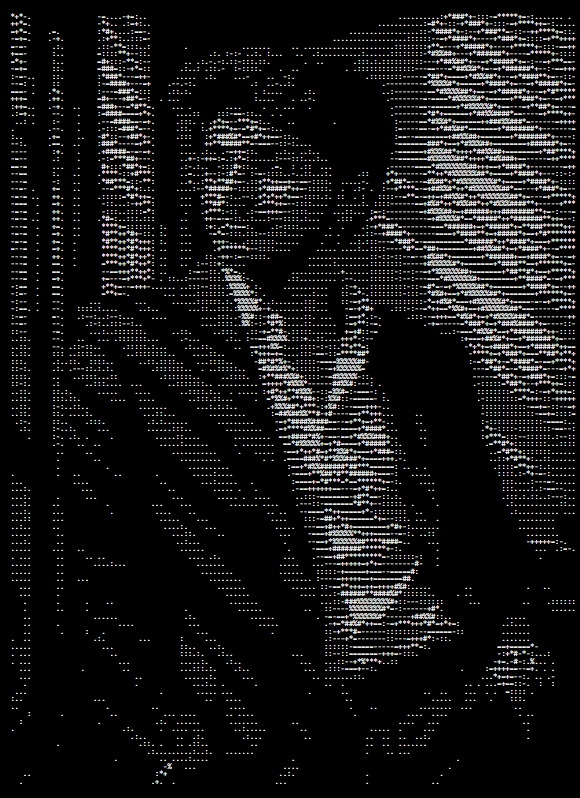

<table width="100%" cellspacing="0" cellpadding="0" border="0">
<tr>

<td width="43%" align="center" valign="top">

 

  

<strong>Aishwary Vishwakarma</strong> 
<code>AETHERNOX</code>

</td>

<td width="57%" valign="top">

<pre>
aishwary ─────────────────────────────────────────

OS:                  Linux, Windows
Role:                AI/ML • Robotics • Software
Focus:               Computer Vision, NLP, Robotics
Languages:           Python, C++, C, Java, Flutter
Frameworks:          PyTorch, FastAPI, ROS 2
Tools:               Git, Docker, Gazebo, Jupyter

Projects ─────────────────────────────────────────

Robotics:            Quadruped / Robo Dog
                     Inverse Kinematics
                     Servo Control & Calibration
                     Gazebo / ROS 2 Simulation

AI / ML:             Computer Vision
                     NLP & Transformers
                     Speaker Diarization
                     ML Infrastructure

Development ─────────────────────────────────────

Backend:             FastAPI, Python
Deployment:           Docker, Docker Compose
Cloud:                GCP
Frontend:             Flutter / Web

Contact ──────────────────────────────────────────

GitHub:              AETHERNOX
College:             NIT Delhi

──────────────────────────────────────────────────
Building intelligent systems where
AI, software and robotics meet.
</pre>

</td>

</tr>
</table>

